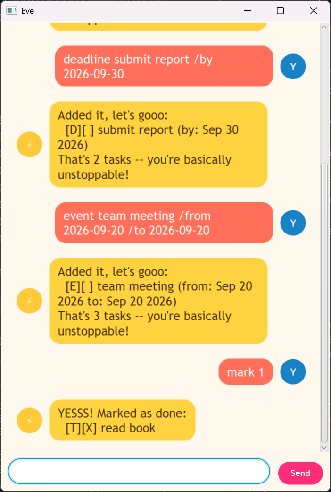

# Eve User Guide



HEYYY! I'm Eve, your hype-squad task list -- I track your to-dos, deadlines, and events, and I am **SO ready** to help you crush your day. Type commands into the box at the bottom, hit Enter (or click Send), and I'll take it from there. Your tasks are saved automatically, so they're still there the next time you open me.

Not sure what to type? Just send `help` any time.

- [Quick start](#quick-start)
- [Features](#features)
  - [Viewing every command: `help`](#viewing-every-command-help)
  - [Adding a to-do: `todo`](#adding-a-to-do-todo)
  - [Adding a deadline: `deadline`](#adding-a-deadline-deadline)
  - [Adding an event: `event`](#adding-an-event-event)
  - [Listing all tasks: `list`](#listing-all-tasks-list)
  - [Finding tasks by keyword: `find`](#finding-tasks-by-keyword-find)
  - [Viewing tasks on a date: `on`](#viewing-tasks-on-a-date-on)
  - [Viewing your schedule: `schedule`](#viewing-your-schedule-schedule)
  - [Marking a task as done: `mark`](#marking-a-task-as-done-mark)
  - [Marking a task as not done: `unmark`](#marking-a-task-as-not-done-unmark)
  - [Deleting a task: `delete`](#deleting-a-task-delete)
  - [Exiting: `bye`](#exiting-bye)
  - [Saving your data](#saving-your-data)
- [Command summary](#command-summary)

## Quick start

1. Make sure you have **Java 25** installed.
2. Download the latest `eve.jar` from the [releases page](https://github.com/Alloyshoes/ip/releases).
3. Put it in a folder you're happy for Eve to keep her data file in, then run it from that folder:
   ```
   java -jar eve.jar
   ```
4. Eve's window should appear, ready for your first command.

## Features

Every command below works the same whether you type it into the GUI's input box or (if you're running the command-line version) at the console prompt.

Dates are always written as `yyyy-mm-dd`, e.g. `2019-12-02`.

### Viewing every command: `help`

Shows the full list of commands, with their usage and a short description.

Example: `help`

```
Here's everything I can do:

• help
   Show this list of commands again!

• todo <description>
   Add a to-do task!

• deadline <description> /by <yyyy-mm-dd>
   Add a task with a deadline!

...
```

### Adding a to-do: `todo`

Adds a task with just a description -- no date attached.

Example: `todo read book`

```
Added it, let's gooo:
  [T][ ] read book
That's 1 tasks -- you're basically unstoppable!
```

### Adding a deadline: `deadline`

Adds a task that needs to be done by a specific date.

Example: `deadline return book /by 2019-12-02`

```
Added it, let's gooo:
  [D][ ] return book (by: Dec 2 2019)
That's 2 tasks -- you're basically unstoppable!
```

### Adding an event: `event`

Adds a task that runs from one date to another (inclusive). A single-day event is fine too -- just give the same date for both.

Example: `event project meeting /from 2019-10-04 /to 2019-10-11`

```
Added it, let's gooo:
  [E][ ] project meeting (from: Oct 4 2019 to: Oct 11 2019)
That's 3 tasks -- you're basically unstoppable!
```

### Listing all tasks: `list`

Shows every task currently on your list, numbered from 1.

Example: `list`

```
Here's everything on your list:
1.[T][ ] read book
2.[D][ ] return book (by: Dec 2 2019)
3.[E][ ] project meeting (from: Oct 4 2019 to: Oct 11 2019)
```

### Finding tasks by keyword: `find`

Shows only the tasks whose description contains the given keyword (case-insensitive), across every task type.

Example: `find book`

```
Found these matches for you:
1.[T][ ] read book
2.[D][ ] return book (by: Dec 2 2019)
```

### Viewing tasks on a date: `on`

Shows every deadline and event that occurs on a given date -- a deadline matches its exact due date, and an event matches any date within its start/end range (both ends included).

Example: `on 2019-10-07`

```
Here's what's happening on Oct 7 2019:
1.[E][ ] project meeting (from: Oct 4 2019 to: Oct 11 2019)
```

### Viewing your schedule: `schedule`

Shows every deadline and event across your whole list, earliest first -- to-dos aren't included, since they don't have a date. Give it a date (`schedule 2019-10-07`) to see just that one date's tasks instead, same as `on`.

Example: `schedule`

```
Here's your schedule, all lined up:
1.[E][ ] project meeting (from: Oct 4 2019 to: Oct 11 2019)
2.[D][ ] return book (by: Dec 2 2019)
```

### Marking a task as done: `mark`

Marks the given task (by its number in `list`) as done.

Example: `mark 2`

```
YESSS! Marked as done:
  [D][X] return book (by: Dec 2 2019)
```

### Marking a task as not done: `unmark`

Reverses a task's done status back to not-done.

Example: `unmark 2`

```
Got it, back on the list:
  [D][ ] return book (by: Dec 2 2019)
```

### Deleting a task: `delete`

Removes the given task (by its number in `list`) from your list for good.

Example: `delete 2`

```
Poof, gone! Removed:
  [D][ ] return book (by: Dec 2 2019)
Down to 2 tasks -- look at you go!
```

### Exiting: `bye`

Says goodbye and closes Eve.

Example: `bye`

```
Byeee! Go crush it out there -- see you again soon!
```

### Saving your data

Eve saves your task list to disk automatically after every command that changes it -- there's no separate save command, and nothing to remember. The next time you open Eve, everything picks up right where you left off.

## Command summary

| Action | Format | Example |
|---|---|---|
| Help | `help` | `help` |
| Todo | `todo <description>` | `todo read book` |
| Deadline | `deadline <description> /by <yyyy-mm-dd>` | `deadline return book /by 2019-12-02` |
| Event | `event <description> /from <yyyy-mm-dd> /to <yyyy-mm-dd>` | `event project meeting /from 2019-10-04 /to 2019-10-11` |
| List | `list` | `list` |
| Find | `find <keyword>` | `find book` |
| On | `on <yyyy-mm-dd>` | `on 2019-10-07` |
| Schedule | `schedule [yyyy-mm-dd]` | `schedule` or `schedule 2019-10-07` |
| Mark | `mark <task number>` | `mark 2` |
| Unmark | `unmark <task number>` | `unmark 2` |
| Delete | `delete <task number>` | `delete 2` |
| Bye | `bye` | `bye` |
